# lus-android

**Language:** Kotlin

**Framework:** Android Studio

**Sever:** <a href="https://github.com/VTNPlusD/lus-sever" >Sever NodeJs</a>

**A Colection of samples using the Architechture Components:**
- Lifecycle-aware components
- Viewmodels
- LiveData
- DataBinding

**The app has following packages:**
- **data:** It contains all the data accessing and manipulating components.
- **di:** Dependency providing classes using Koin.
- **domain:** It is the most INNER part of onion (no dependencies with other layers) and it contains Entities, Use cases & Repository Interfaces. Use cases combine data form one or multiple Repository Interfaces.
- **ui:** View classes along with their corresponding ViewModel.
- **utils:** Utility classes.

**Classes have been designed in such a way that it could be inherited and maximize the code reuse.**

**library reference resources:**

- **Coroutines:** https://github.com/Kotlin/kotlinx.coroutines
- **Retroifit:** https://square.github.io/retrofit/
- **OkHttp:** https://square.github.io/okhttp/
- **Moshi:** https://github.com/square/moshi/
- **Glide:** https://github.com/bumptech/glide/
- **Arrow:** https://github.com/arrow-kt/arrow/
- **Lifecycler:** https://developer.android.com/jetpack/androidx/releases/lifecycle/
- **Timber:** https://github.com/JakeWharton/timber/
- **Firebase SDK Analytics:** https://firebase.google.com/docs/android/setup/
- **SDK for Firebase Cloud Messaging:** https://firebase.google.com/docs/android/setup/
- **Koin:** https://github.com/InsertKoinIO/koin/
- **CicleImageView:** https://github.com/hdodenhof/CircleImageView/
- **...**

## Screen App
|                         |                         |                         |                         |
|        :---:            |          :---:          |        :---:            |          :---:          |
| 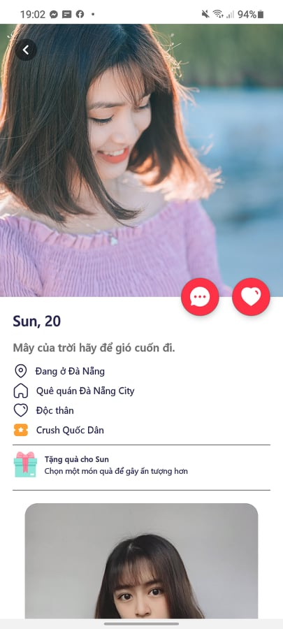 | 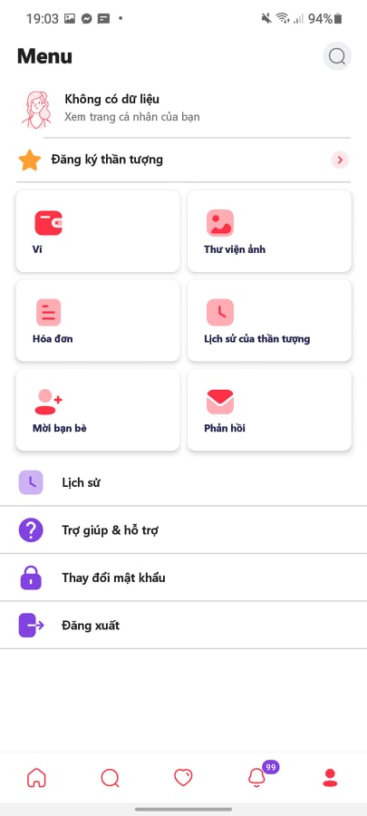 | 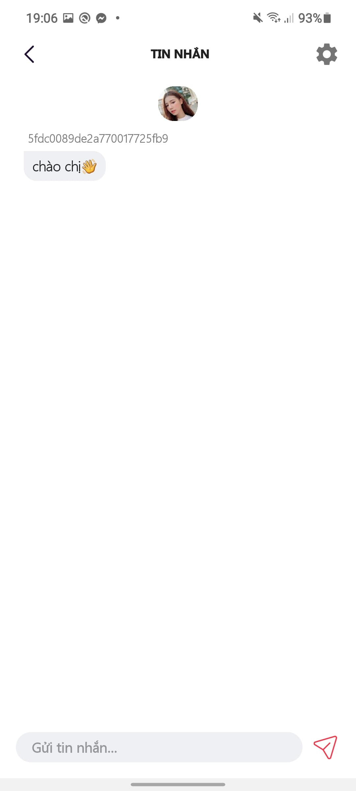 | 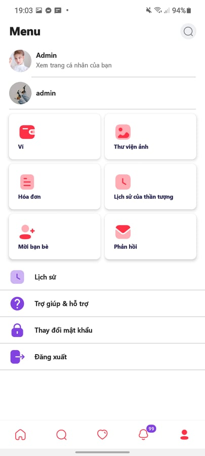 |
| 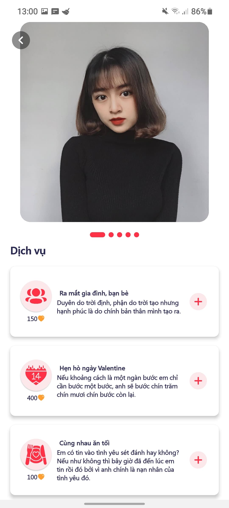 | 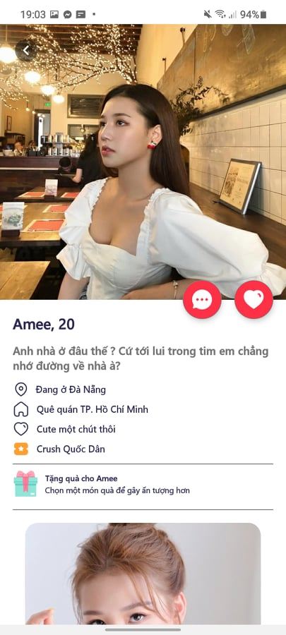 | 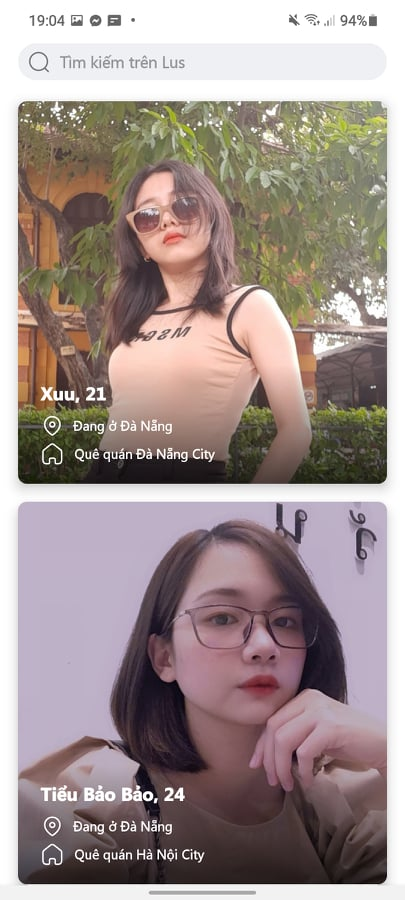 | 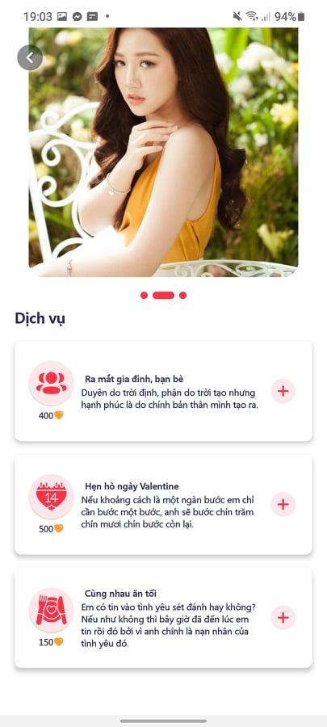 |
| 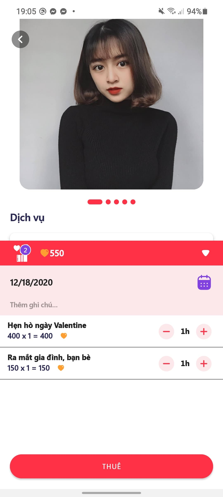 | 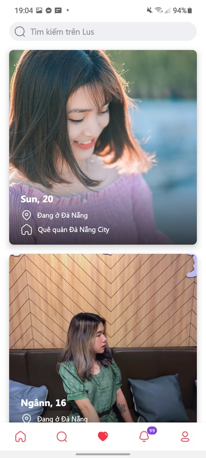 | 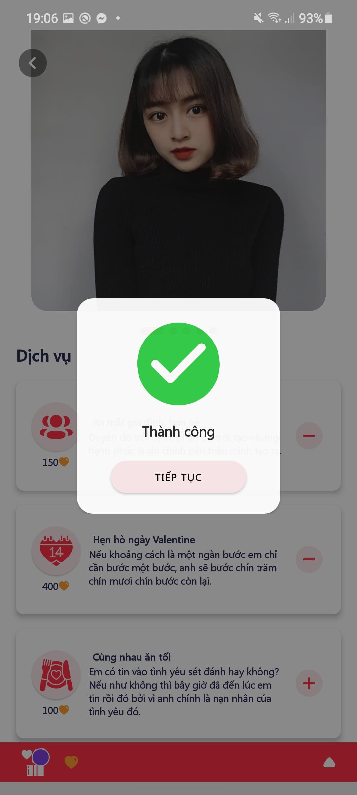 | 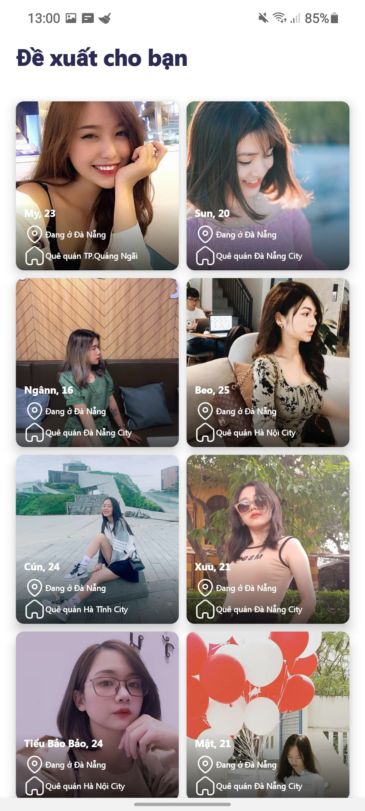 |
| 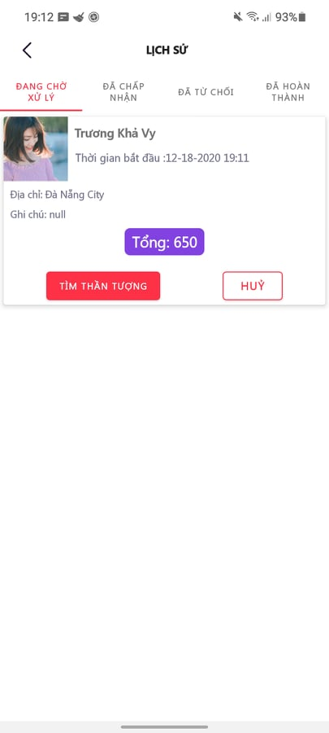 | 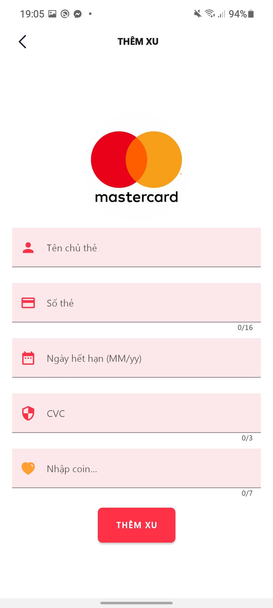 | 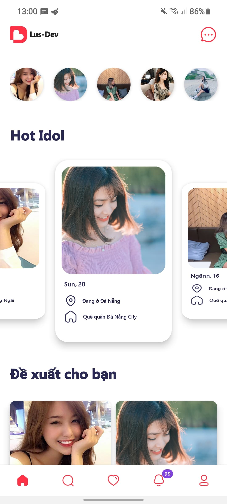 | 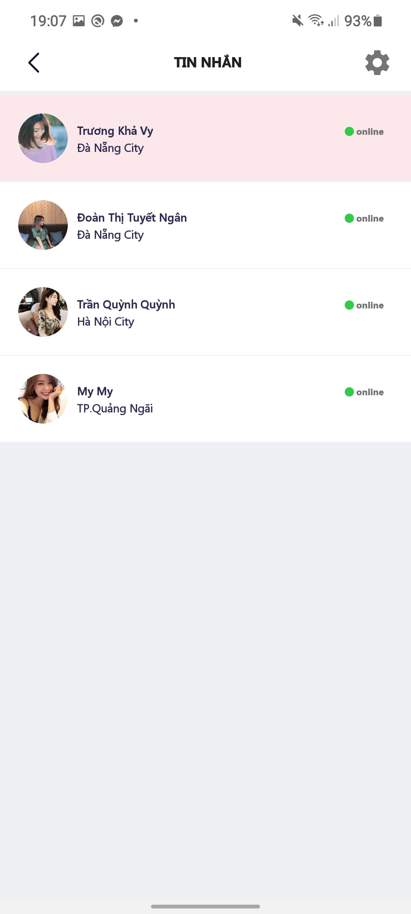 |
| 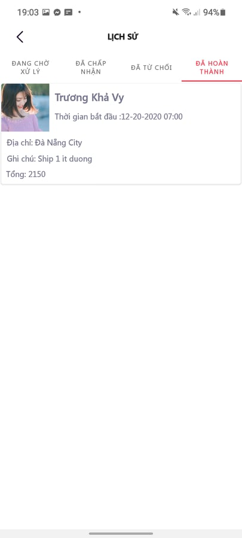
